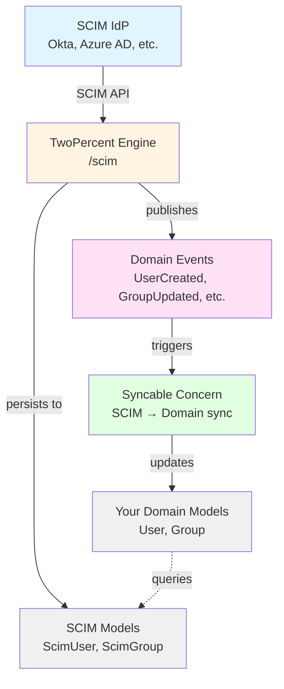

# TwoPercent [](https://travis-ci.org/powerhome/two_percent)

## What is TwoPercent

TwoPercent is a SCIM 2.0 (System for Cross-domain Identity Management) Rails Engine that handles identity provisioning from external Identity Providers (IdPs). It provides endpoints for creating, updating, and deleting Users and Groups, and publishes domain events when resources change.

## SCIM 2.0 Compliance

**Implemented (Partial RFC 7644 Protocol Compliance):**
- ✅ POST (Create) for Users and Groups
- ✅ PUT (Replace) for Users and Groups
- ✅ PATCH (Partial Update) with Operations array
- ✅ DELETE for Users and Groups
- ✅ GET (Single resource retrieval)
- ✅ GET with filtering and pagination (List operations)
- ✅ Bulk operations (bulkId references, continue-on-error)
- ✅ RFC 7644 Section 3.12 error responses with scimType
- ✅ Extension schema support

**Not Yet Implemented:**
- ❌ RFC 7644 `filter` parameter with full SCIM filter expression parsing (simple `query` parameter supported for display_name filtering)
- ❌ Sorting (sortBy, sortOrder parameters)
- ❌ ETag support for concurrency control
- ❌ Discovery endpoints (RFC 7642): /ServiceProviderConfig, /ResourceTypes, /Schemas
- ❌ Full RFC 7643 schema validation

**RFC 7643 Deviations (Intentional):**
- ⚠️ **User.groups is writable**: RFC 7643 Section 4.1.2 specifies User.groups as read-only, but TwoPercent accepts `groups` arrays in POST/PUT User operations to support bulk sync workflows from existing SCIM clients. Group memberships are synced automatically via `ScimUser.sync_groups`. PATCH operations on User.groups are correctly rejected per RFC. For strict RFC compliance, manage memberships exclusively via `PATCH /Groups/{id}` operations.

**Note:** The current release supports full CRUD operations for IdP provisioning, including read operations with RFC 7644-compliant ListResponse format. Advanced filtering and discovery endpoints are on the roadmap for future releases.

## Architecture

TwoPercent is designed as a standalone gem that can be mounted in a parent Rails application:



**Key Principles:**
- **SCIM as Source of Truth**: Identity data flows one-way from IdP → TwoPercent → Your App
- **Domain Events**: TwoPercent publishes domain events when SCIM resources change
- **Syncable Concern**: Optional helper for syncing SCIM data to your domain models
- **Direct Model Access**: Query `ScimUser` and `ScimGroup` models directly when needed

## API Endpoints

TwoPercent provides SCIM 2.0 endpoints for all standard CRUD operations with RFC 7644 ListResponse format for collection endpoints.

### Authentication

All endpoints require authentication via the configured `authenticate` block (see Configuration section). Typically uses HTTP Bearer token authentication.

### Content Types

Per RFC 7644, requests should use `Content-Type: application/scim+json`. For backward compatibility, `application/json` is also accepted.

### Resource Types

**Users:**
- `POST /scim/Users` - Create user
- `GET /scim/Users/:id` - Get single user
- `GET /scim/Users` - List/search users
- `PATCH /scim/Users/:id` - Update user
- `PUT /scim/Users/:id` - Replace user
- `DELETE /scim/Users/:id` - Delete user

**Groups:**
- `POST /scim/:resource_type` - Create group (e.g., `/scim/Groups`)
- `GET /scim/:resource_type/:id` - Get single group
- `GET /scim/:resource_type` - List/search groups
- `PATCH /scim/:resource_type/:id` - Update group
- `PUT /scim/:resource_type/:id` - Replace group
- `DELETE /scim/:resource_type/:id` - Delete group

**Note:** By default, only `Groups` is supported. To enable additional custom resource types, configure them in your initializer (see [Configuration](#configuration)).

### GET - Single Resource Retrieval

Retrieve a single SCIM resource by ID.

**Request:**
```http
GET /scim/Users/abc123
Authorization: Bearer <token>
```

**Response (200 OK):**
```json
{
  "schemas": ["urn:ietf:params:scim:schemas:core:2.0:User"],
  "id": "abc123",
  "externalId": "user@example.com",
  "userName": "user@example.com",
  "name": {
    "givenName": "John",
    "familyName": "Doe"
  },
  "emails": [
    {
      "value": "user@example.com",
      "primary": true
    }
  ],
  "active": true,
  "groups": [],
  "meta": {
    "resourceType": "User",
    "created": "2024-01-15T10:30:00Z",
    "lastModified": "2024-01-15T10:30:00Z"
  }
}
```

**Error Response (404 Not Found):**
```json
{
  "schemas": ["urn:ietf:params:scim:api:messages:2.0:Error"],
  "status": "404",
  "detail": "Resource \"abc123\" not found"
}
```

### GET - List/Search Resources

Retrieve multiple resources with optional filtering and pagination. Returns RFC 7644 ListResponse format with legacy query filtering.

**Request:**
```http
GET /scim/Users?query=john&startIndex=1&count=10
Authorization: Bearer <token>
```

**Query Parameters:**
- `query` (optional) - Filter by display_name substring match (case-insensitive)
- `startIndex` (optional) - 1-based index of first result (default: 1)
- `count` (optional) - Maximum number of results to return (default: 100, max: 1000)

**Response (200 OK):**
```json
{
  "schemas": ["urn:ietf:params:scim:api:messages:2.0:ListResponse"],
  "totalResults": 42,
  "startIndex": 1,
  "itemsPerPage": 10,
  "Resources": [
    {
      "schemas": ["urn:ietf:params:scim:schemas:core:2.0:User"],
      "id": "abc123",
      "externalId": "user@example.com",
      "userName": "user@example.com",
      "displayName": "John Doe",
      "active": true,
      "meta": {
        "resourceType": "User",
        "created": "2024-01-15T10:30:00Z",
        "lastModified": "2024-01-15T10:30:00Z"
      }
    }
    // ... more resources
  ]
}
```

**Empty Results:**
```json
{
  "schemas": ["urn:ietf:params:scim:api:messages:2.0:ListResponse"],
  "totalResults": 0,
  "startIndex": 1,
  "itemsPerPage": 0,
  "Resources": []
}
```

**Examples:**
```bash
# Get all users
curl -H "Authorization: Bearer <token>" https://your-app.com/scim/Users

# Search users by name
curl -H "Authorization: Bearer <token>" "https://your-app.com/scim/Users?query=john"

# Paginated results
curl -H "Authorization: Bearer <token>" "https://your-app.com/scim/Users?startIndex=11&count=10"

# Get all groups (works out-of-box)
curl -H "Authorization: Bearer <token>" https://your-app.com/scim/Groups

# Search groups by name
curl -H "Authorization: Bearer <token>" "https://your-app.com/scim/Groups?query=engineering"

# Custom resource types (requires configuration - see Group Resource Types section)
curl -H "Authorization: Bearer <token>" https://your-app.com/scim/Departments
```

### POST - Create Resource

Create a new SCIM resource. Publishes domain events.

**Request:**
```http
POST /scim/Users
Authorization: Bearer <token>
Content-Type: application/scim+json

{
  "schemas": ["urn:ietf:params:scim:schemas:core:2.0:User"],
  "externalId": "user@example.com",
  "userName": "user@example.com",
  "name": {
    "givenName": "John",
    "familyName": "Doe"
  },
  "emails": [
    {
      "value": "user@example.com",
      "primary": true
    }
  ],
  "active": true
}
```

**Response (201 Created):**
- Status: 201 Created
- Location header: `https://your-app.com/scim/Users/abc123`
- Body: Full SCIM resource representation
- Domain Event: `TwoPercent::Domain::Events::UserCreated` published

### PATCH - Update Resource

Partially update a SCIM resource using RFC 7644 PATCH operations. Publishes domain events.

**Request:**
```http
PATCH /scim/Users/abc123
Authorization: Bearer <token>
Content-Type: application/scim+json

{
  "schemas": ["urn:ietf:params:scim:api:messages:2.0:PatchOp"],
  "Operations": [
    {
      "op": "replace",
      "path": "active",
      "value": false
    },
    {
      "op": "replace",
      "path": "name.givenName",
      "value": "Jane"
    }
  ]
}
```

**Response (200 OK):**
- Body: Updated SCIM resource representation
- Domain Event: `TwoPercent::Domain::Events::UserUpdated` published

### PUT - Replace Resource

Replace entire SCIM resource (upsert). Publishes domain events.

**Request:**
```http
PUT /scim/Users/abc123
Authorization: Bearer <token>
Content-Type: application/scim+json

{
  "schemas": ["urn:ietf:params:scim:schemas:core:2.0:User"],
  "id": "abc123",
  "externalId": "user@example.com",
  "userName": "user@example.com",
  "active": true
  // ... full resource
}
```

**Response:**
- Status: 200 OK (if resource existed) or 201 Created (if new)
- Location header: Set on 201 Created
- Body: Full SCIM resource representation
- Domain Event: `UserUpdated` or `UserCreated` published

### DELETE - Delete Resource

Delete a SCIM resource. Publishes domain events.

**Request:**
```http
DELETE /scim/Users/abc123
Authorization: Bearer <token>
```

**Response (204 No Content):**
- Status: 204 No Content
- No body
- Domain Event: `TwoPercent::Domain::Events::UserDeleted` published

### Bulk Operations

Perform multiple operations in a single request.

**Request:**
```http
POST /scim/Bulk
Authorization: Bearer <token>
Content-Type: application/scim+json

{
  "schemas": ["urn:ietf:params:scim:api:messages:2.0:BulkRequest"],
  "Operations": [
    {
      "method": "POST",
      "path": "/Users",
      "bulkId": "user1",
      "data": { /* SCIM user */ }
    },
    {
      "method": "PATCH",
      "path": "/Users/abc123",
      "data": { /* PATCH operations */ }
    }
  ]
}
```

**Response (200 OK):**
- Contains status for each operation
- Supports bulkId references between operations
- See RFC 7644 Section 3.7 for full details

## Installation

Add to your application with bundle

```ruby
bundle add two_percent
```

Run the install generator:

```bash
rails generate two_percent:install
rails db:migrate
```

Mount the engine in your parent application's `config/routes.rb`:

```ruby
mount TwoPercent::Engine => "/scim"
```

## Configuration

Configure TwoPercent in `config/initializers/two_percent.rb`:

### Authentication

Authentication is required for SCIM endpoints. Configure it using the `authenticate` block:

```ruby
TwoPercent.configure do |config|
  config.authenticate = ->(*) do
    authenticate_with_http_token do |token|
      Token.active.find_by!(token:)
    end
  end
end
```

See the [Authenticating SCIM requests](#authenticating-scim-requests) section for more details.

### Group Resource Types

By default, TwoPercent supports only the standard SCIM "Groups" resource type. To enable additional company-specific group types, configure them explicitly:

```ruby
TwoPercent.configure do |config|
  # Enable custom group types for your organization
  config.group_resource_types = %w[Groups Departments Territories]
end
```

**Default:** `%w[Groups]`

**What this controls:**
- Which resource types are accepted at `/scim/:resource_type` endpoints
- All configured types store data in the same `scim_groups` table with a `resource_type` column
- Domain events include the `resource_type` to distinguish between group types

**Examples of custom group types:**
You can define any resource types that fit your organization's structure, such as:
- `Departments` - Organizational departments
- `Territories` - Geographic regions or sales territories

All configured types support the full CRUD API (POST/PUT/PATCH/DELETE/GET).

## Integration

TwoPercent provides three ways to integrate SCIM data with your application:

### 1. Domain Events (Recommended)

TwoPercent publishes domain events whenever SCIM resources are created, updated, or deleted. Subscribe to these events to keep your domain models in sync:

**Available Events:**

| Event Class | When Published | Attributes |
|-------------|----------------|------------|
| `TwoPercent::Domain::Events::UserCreated` | SCIM user created | `user_attributes` (Hash), `correlation_id` (String) |
| `TwoPercent::Domain::Events::UserUpdated` | SCIM user updated | `user_attributes` (Hash), `correlation_id` (String) |
| `TwoPercent::Domain::Events::UserDeleted` | SCIM user deleted | `user_id` (String), `correlation_id` (String) |
| `TwoPercent::Domain::Events::GroupCreated` | SCIM group created | `group_attributes` (Hash), `resource_type` (String), `correlation_id` (String) |
| `TwoPercent::Domain::Events::GroupUpdated` | SCIM group updated | `group_attributes` (Hash), `resource_type` (String), `correlation_id` (String) |
| `TwoPercent::Domain::Events::GroupDeleted` | SCIM group deleted | `group_id` (String), `resource_type` (String), `correlation_id` (String) |

**Example: Subscribe to domain events**

```ruby
# app/subscribers/scim_user_subscriber.rb
class ScimUserSubscriber
  def self.call(event)
    case event
    when TwoPercent::Domain::Events::UserCreated
      handle_user_created(event)
    when TwoPercent::Domain::Events::UserUpdated
      handle_user_updated(event)
    when TwoPercent::Domain::Events::UserDeleted
      handle_user_deleted(event)
    end
  end

  def self.handle_user_created(event)
    attrs = event.user_attributes
    User.create!(
      scim_id: attrs[:scim_id],
      email: attrs[:email],
      first_name: attrs.dig(:name, :givenName),
      last_name: attrs.dig(:name, :familyName),
      active: attrs[:active]
    )
  end

  def self.handle_user_updated(event)
    attrs = event.user_attributes
    user = User.find_by(scim_id: attrs[:scim_id])
    user&.update!(
      email: attrs[:email],
      first_name: attrs.dig(:name, :givenName),
      last_name: attrs.dig(:name, :familyName),
      active: attrs[:active]
    )
  end

  def self.handle_user_deleted(event)
    User.find_by(scim_id: event.user_id)&.destroy
  end
end

# Subscribe to events (in an initializer or event handler registration)
ActiveSupport::Notifications.subscribe(/TwoPercent::Domain::Events/) do |name, start, finish, id, payload|
  event = payload[:event]
  ScimUserSubscriber.call(event) if event.is_a?(TwoPercent::Domain::Events::Base)
end
```

### 2. Syncable Concern (Declarative)

For simpler integration, include the `TwoPercent::Syncable` concern in your domain models. This provides automatic SCIM → Domain synchronization:

```ruby
# app/models/user.rb
class User < ApplicationRecord
  include TwoPercent::Syncable

  syncable_as :user, scim_id_column: :scim_id do |scim_attrs|
    {
      first_name: scim_attrs.dig(:name, :givenName),
      last_name: scim_attrs.dig(:name, :familyName),
      email: scim_attrs[:email],
      active: scim_attrs[:active]
    }
  end
end

# app/models/group.rb
class Group < ApplicationRecord
  include TwoPercent::Syncable

  syncable_as :group, scim_id_column: :scim_id do |scim_attrs|
    {
      name: scim_attrs[:display_name],
      active: scim_attrs[:active]
    }
  end
end
```

**Syncable provides:**
- `user.scim_user` - Association to linked `TwoPercent::ScimUser` record
- `user.refresh_from_scim` - Pull latest SCIM data and update domain model
- `User.sync_from_scim_event(event)` - Sync from domain events

**Sync from events:**

```ruby
# Subscribe to events and sync automatically
ActiveSupport::Notifications.subscribe(/TwoPercent::Domain::Events/) do |name, start, finish, id, payload|
  event = payload[:event]
  case event
  when TwoPercent::Domain::Events::UserCreated, TwoPercent::Domain::Events::UserUpdated
    User.sync_from_scim_event(event)
  when TwoPercent::Domain::Events::UserDeleted
    User.sync_from_scim_event(event)
  when TwoPercent::Domain::Events::GroupCreated, TwoPercent::Domain::Events::GroupUpdated
    Group.sync_from_scim_event(event)
  when TwoPercent::Domain::Events::GroupDeleted
    Group.sync_from_scim_event(event)
  end
end
```

**Important:** The attribute mapper block is **mandatory** and must explicitly map SCIM attributes to your domain model's attributes. This ensures you have full control over what data syncs and how it transforms.

### 3. Direct Model Access

Query `ScimUser` and `ScimGroup` models directly for read-only access to SCIM data, or use the GET API endpoints:

**Via ActiveRecord Models:**
```ruby
# Find user by SCIM ID
scim_user = TwoPercent::ScimUser.find_by_scim_id("user-123")

# Access SCIM attributes
scim_user.scim_data["email"]
scim_user.scim_data["name"]["givenName"]

# Get domain-friendly hash
attrs = scim_user.to_domain_attributes
# => { scim_id: "user-123", email: "...", name: { givenName: "...", familyName: "..." }, ... }

# Find group with members
group = TwoPercent::ScimGroup.includes(:scim_users).find_by_scim_id("group-456")
group.scim_users # => Array of ScimUser records
```

**Via GET API Endpoints:**
```bash
# Get single resource
GET /scim/Users/user-123

# List/search resources with pagination and filtering
GET /scim/Users?query=john&startIndex=1&count=10
GET /scim/Groups
GET /scim/Groups?query=engineering

# Custom resource types (requires configuration)
GET /scim/Departments
```

See the [API Endpoints](#api-endpoints) section for full GET endpoint documentation.

**Available Models:**
- `TwoPercent::ScimUser` - Stores user SCIM data
- `TwoPercent::ScimGroup` - Stores group SCIM data (Groups and any configured custom types)

## Authenticating SCIM requests

Most of the applications will want to secure the requests to SCIM. This can be done using the `authenticate` configuration:

I.e.:

```ruby
TwoPercent.configure do |config|
  config.authenticate = ->(*) do
    authenticate_with_http_token do |token|
      Token.active.find_by!(token:)
    end
  end
end
```

## Development

After checking out the repo, run `bin/setup` to install dependencies. Then, run
`rake spec` to run the tests. You can also run `bin/console` for an interactive
prompt that will allow you to experiment.

To install this gem onto your local machine, run `bundle exec rake install`. To
release a new version, update the version number in `version.rb`, and then run
`bundle exec rake release`, which will create a git tag for the version, push
git commits and tags, and push the `.gem` file to [rubygems.org](https://rubygems.org).

## Contributing

Bug reports and pull requests are welcome on GitHub at https://github.com/powerhome/two_percent.
